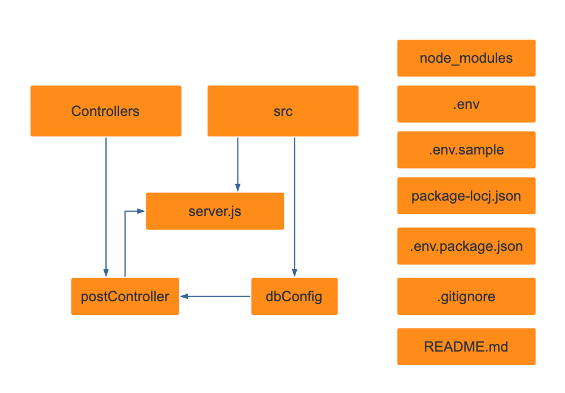

# ExpressSQL

# Stack

- [Node.js](https://nodejs.org/)
- GIT/GITHUB (code management)
- [ElephantSQL](https://www.elephantsql.com/) (PostgreSQL database)
- [Postman](https://www.postman.com/) (API testing)

# How to run locally

- System requirements: [Node.js](https://nodejs.org/)
- Fork the repository
- Clone it to your local repo
- Run "npm install" to install dependencies
  - "body-parser": "^1.19.0",
  - "dotenv": "^8.2.0",
  - "express": "^4.17.1",
  - "nodemon": "^2.0.4",
  - "pg": "^8.3.3"
- Run "npm start" to run local server
- See .env.sample for environment variables

# Features

| Endpoint                                     | Route                                                         |
| -------------------------------------------- | ------------------------------------------------------------- |
| GET (all posts from database)                | ("/posts")                                                    |
| GET (filtered all posts via query params     | ("/posts/?continent={continent}&limit={limit}&rating={rating} |
| GET (the best 5 rates posts)                 | ("/posts/highest-rating") (default: limit=5 DESC)             |
| GET (filtered rated posts via query params   | ("/posts/highest-rating/?continent={continent}                |
| POST (new post to database)                  | ("/posts")                                                    |
| GET (filtered post by id via route params)   | ("/posts/:id"                                                 |
| PUT (update post by id via route params)     | ("/posts/:id"                                                 |
| DELETE (DELTE post by id via route params)   | ("/posts/:id"                                                 |
| GET (filtered post by id via route params)   | ("/admin/:id"                                                 |
| PUT (update imageurl by id via route params) | ("/admin/:id"                                                 |
| DELETE (DELTE post by id via route params)   | ("/admin/:id"                                                 |

# Structure

| File               | Description                             |
| ------------------ | --------------------------------------- |
| server.js          | Server and endpoints                    |
| dbConfig.js        | Configuration of database (ElephantSQL) |
| postController.js  | Controllers for post endpoints          |
| postRoutes.js      | Configuration of post routes            |
| AdminRoutes.js     | Configuration of admin routes           |

# Front-End-connection
[React-App:ExpressSQLApp](https://github.com/Natascha2020/ExpressSQLApp.git)

# Structure

# Credits

- Pictures are CC0 Creative Commons, attribution free, taken from:[Pixabay](https://pixabay.com/)
- Node-graph is created with the free online tool by [yworks](https://live.yworks.com/demos/layout/layoutstyles/index.html)
